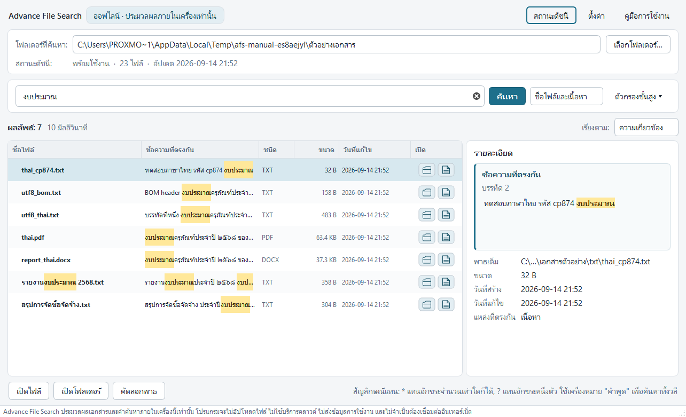
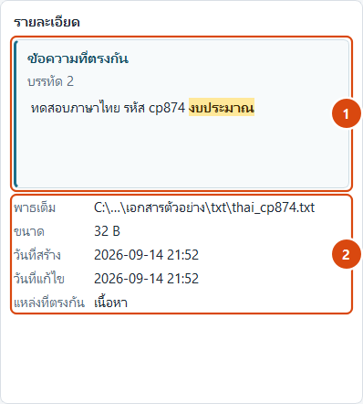
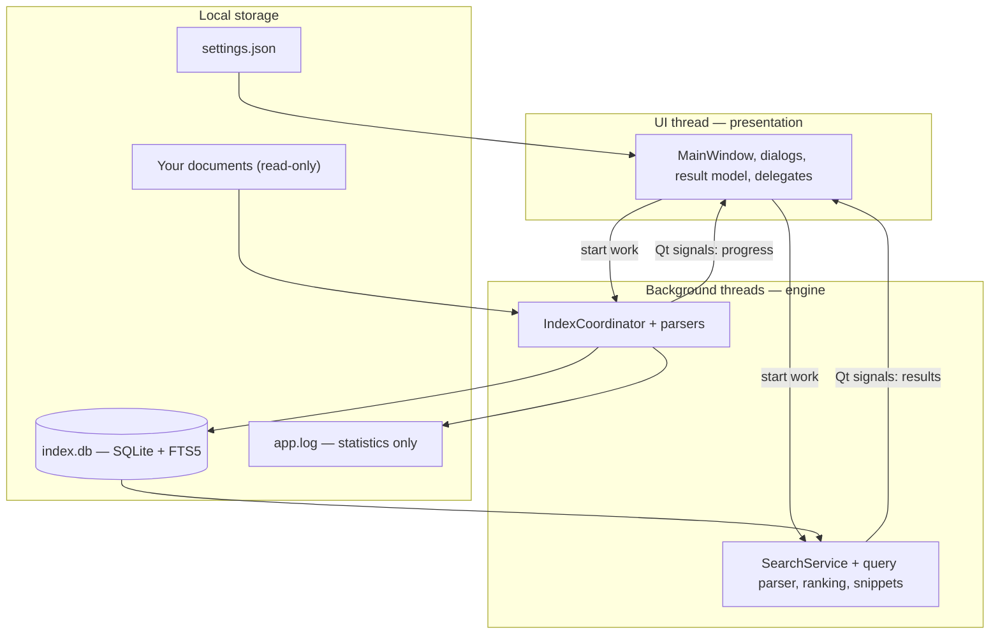

# Advance File Search

[](https://github.com/tncyber-research/advance-file-search/actions/workflows/ci.yml)


Offline full-text search for local Windows documents, with first-class Thai
support. It reads the text inside PDF, Word, Excel and plain-text files,
stores it in a local index, and finds it again — telling you not just which
file matched, but the page, paragraph, cell or line it matched on.

Everything happens on the machine it runs on. The packaged application has no
networking capability at all: the sockets and TLS libraries are physically
absent from the distribution, which is asserted by the test suite.

---

## The problem it solves

People remember a phrase from a document long after they have forgotten which
file it was in. Windows search covers file names well and file *contents*
unevenly, and cloud search services solve it only by uploading the documents —
which is not an option for government paperwork, internal records or anything
else confidential.

Thai makes it harder. Thai does not put spaces between words, so a
word-boundary tokenizer treats a whole Thai sentence as a single token and
finds nothing for a word inside it. A 300-document experiment measured the
gap directly:

| Tokenizer | Hits for `งบประมาณ` inside unspaced Thai | Hits that actually exist |
|---|---|---|
| `unicode61` | 154 | 1,882 |
| `trigram` (chosen) | **1,882** | 1,882 |

See [ADR 0001](docs/decisions/0001-thai-search.md).

---

## Features

Every item below is implemented and covered by tests in `tests/`.

**Search**
- Full-text search over document contents and file names, Thai and English
- Substring matching in unspaced Thai, via an FTS5 trigram index
- Scope selector: file names only, contents only, or both
- Options: match case, whole word, exact phrase
- Wildcards `*` and `?`, matched by a linear matcher (no regex engine, so no
  catastrophic backtracking)
- Filters: file type, modified-date range, size range, subfolder
- Sorting by relevance, name, size, modified date, created date or type
- Match locations: `Page 2`, `Paragraph 24`, `Sheet: งบประมาณ 2568, Cell: F12`,
  `Line 135`

**Indexing**
- Incremental: new, modified, renamed and deleted files are detected by a
  fingerprint (size + modified time + parser version), so re-indexing does not
  re-read unchanged files
- Driven by searching — there is no "update index" button to remember
- Per-file transactions: one unreadable file never aborts a run
- Cancellable at file boundaries, leaving the index usable

**Formats**
- PDF (page-level), DOCX (paragraphs, tables, headers and footers),
  XLSX (cell-level, hidden sheets skipped, formulas not recalculated),
  TXT/MD/CSV/LOG with UTF-8, UTF-8 BOM, UTF-16 and CP874/TIS-620 detection

**Interface**
- Thai and English, switchable at run time
- Match preview showing the surrounding document text with the query
  highlighted (painted as plain text — document content is never rendered as
  markup)
- Per-row buttons to open the containing folder or the file itself, falling
  back to the Windows "Open with" chooser when no program is registered
- Illustrated user manual and project report shipped with the application

**Privacy and safety**
- No network code in the source and no networking libraries in the build
- Logs record statistics and error codes, never document text or search terms
- Local paths only: UNC paths, mapped network drives and URLs are refused
- Shortcuts, junctions and symlinks are not followed; documents are opened
  read-only and never executed

---

## Screenshots

The images below are captured from the running application by
`scripts/make_manual_screenshots.py`.

| Main window | Match preview |
|---|---|
|  |  |

The full walkthrough is in [`Manual/index.html`](Manual/index.html) (Thai),
and the design and test report is in [`Manual/report.html`](Manual/report.html).

---

## Tech stack

| Component | Version | Used for |
|---|---|---|
| Python | 3.12.10 | the entire application |
| PySide6 (Qt 6) | 6.11.2 | windows, tables, threads, signals, theming |
| SQLite + FTS5 | 3.49.1 (bundled with Python) | index storage and full-text search |
| FTS5 `trigram` tokenizer | — | substring search in unspaced Thai |
| PyMuPDF | 1.26.5 | PDF text extraction (**AGPL-3.0 or commercial** — see Licence) |
| python-docx | 1.2.0 | DOCX paragraphs, tables, headers, footers |
| openpyxl | 3.1.5 | XLSX cell values, read-only streaming |
| lxml | 6.0.2 | XML parsing used by the two libraries above |
| PyInstaller | 6.22.2 | packaging into a onedir Windows application |
| pytest | 9.1.1 | the test suite |
| ruff | 0.16.7 | linting, configured in `pyproject.toml` |

---

## Architecture



There is no server process, no local web server and no IPC: the "engine" is
the same process, kept off the UI thread. Details, including the data-flow and
database diagrams, are in [`docs/ARCHITECTURE.md`](docs/ARCHITECTURE.md).

---

## Project structure

```
advance_file_search/     application package
  core/                  constants, models, settings, security, i18n, paths
  indexing/              scanner, fingerprint, coordinator, parsers/
  search/                query parser, wildcard matcher, ranking, snippets
  storage/               database, migrations, repositories, schema.sql
  ui/                    main window, dialogs, result model, delegates, workers
  winplat/               Windows paths, shell integration, single instance
assets/                  application icon (multi-resolution .ico)
build/                   PyInstaller spec and version resource
docs/                    build, security, test report, ADRs, handoff, roadmap
Manual/                  illustrated user manual and project report (HTML)
scripts/                 licence collection, packaging checks, doc generation
tests/                   620 tests; fixtures are generated at run time
```

---

## Prerequisites

- Windows 10 or 11, 64-bit (the application is Windows-only; see Known
  limitations)
- Python 3.12 for development — **not** needed to run the packaged build
- Network access once, at set-up time, to install the pinned dependencies

---

## Installation

### Run the packaged application

Copy the `Advance File Search` folder produced by the build to the target
machine and double-click `AdvanceFileSearch.exe`. Nothing is installed, no
registry keys are written, and no administrator rights are required.

### Set up a development environment

```bat
git clone <repository-url>
cd Advance_FileSearch
python -m venv .venv
.venv\Scripts\python.exe -m pip install --upgrade pip
.venv\Scripts\python.exe -m pip install -r requirements-dev.txt
```

`requirements.txt` pins every runtime dependency to an exact version;
`requirements-dev.txt` adds pytest and PyInstaller.

---

## Environment variables

The application reads no `.env` file and requires no configuration to run.
Two optional variables exist, both for development:

| Variable | Purpose | Example |
|---|---|---|
| `ADVANCE_FILE_SEARCH_DATA_DIR` | Use a scratch data directory instead of `%LOCALAPPDATA%\Advance File Search\` | `D:\scratch\afs-data` |
| `ADVANCE_FILE_SEARCH_DEBUG` | Enable console logging at DEBUG level (same as `--debug`) | `1` |

A third variable, `AFS_DEBUG_BUILD`, is read by the PyInstaller spec to
produce a console-enabled build.

---

## Development commands

```bat
rem Run from source
set PYTHONPATH=D:\PROJECT\Advance_FileSearch
.venv\Scripts\python.exe -m advance_file_search.app

rem Run with console logging
.venv\Scripts\python.exe -m advance_file_search.app --debug

rem Lint
.venv\Scripts\python.exe -m ruff check .

rem Regenerate third-party licence notices
.venv\Scripts\python.exe scripts\collect_licenses.py

rem Regenerate the manual's figures and screenshots
.venv\Scripts\python.exe scripts\make_manual_graphics.py
.venv\Scripts\python.exe scripts\make_manual_screenshots.py
.venv\Scripts\python.exe scripts\make_report_graphics.py
```

---

## Usage

1. Start the application and choose a local folder or drive.
2. Type a word or phrase and press **Search**. The first search builds the
   index automatically; later searches refresh it in the background.
3. Select a result to see the surrounding document text, with the query
   highlighted, and the exact location inside the document.
4. Expand a row to list every location in that file, or use the per-row
   buttons to open the file or its folder.

Query syntax: `"an exact phrase"` in quotation marks, `*` for any number of
characters, `?` for exactly one. Terms shorter than three characters cannot
use the trigram index and fall back to a bounded scan.

---

## Testing

```bat
.venv\Scripts\python.exe -m pytest                 rem everything
.venv\Scripts\python.exe -m pytest -m security     rem privacy and security only
.venv\Scripts\python.exe -m pytest -m gui          rem Qt widget tests
```

Last verified: **619 passed, 1 skipped, 0 failed** (620 collected, ~110 s).
The skip is `test_symlink_directory_is_detected`, which needs Developer Mode
or elevation to create a symlink; the same policy is covered by a junction
test that runs.

Continuous integration runs on Windows for every push and pull request
(`.github/workflows/ci.yml`): `ruff check` plus the 529 tests that need no
windowing system. The 91 Qt widget tests run in a second, advisory job,
because creating real windows depends on the session the runner provides; they
are run locally on a desktop before a release either way.

GUI tests create real windows and need an interactive Windows desktop
session. Every test document is generated at run time by
`tests/make_fixtures.py` — no real or confidential document exists in this
repository.

---

## Build

```bat
.venv\Scripts\python.exe -m PyInstaller build\AdvanceFileSearch.spec --noconfirm
.venv\Scripts\python.exe scripts\postbuild.py "dist\Advance File Search"
.venv\Scripts\python.exe scripts\verify_build.py "dist\Advance File Search"
python scripts\test_packaged_build.py "dist\Advance File Search"
```

`verify_build.py` fails the build if a Qt network or WebEngine DLL appears, if
the licence notices or the manual are missing, or if the schema file is absent.
`test_packaged_build.py` is run with the **system** Python, outside the
virtual environment, to prove the distribution needs nothing from the build
machine. Full details in [`docs/BUILD.md`](docs/BUILD.md).

---

## Deployment

There is no server-side deployment. Distribution is a copy of the
`dist\Advance File Search` folder (about 136 MB, 362 files). Before
distributing outside the organisation that built it, read the Licence section.

---

## Database

SQLite, created and migrated by the application itself at
`%LOCALAPPDATA%\Advance File Search\index\index.db`. There is no external
database server, no migration tool and no seed step: the schema lives in
`advance_file_search/storage/schema.sql` and is applied on first run. Deleting
the file is safe — the index is derived data and is rebuilt from the documents.

---

## Troubleshooting

| Symptom | Cause and remedy |
|---|---|
| A document you know exists is not found | The index may predate it. Use **Index status → Update index**, or check that the right folder is selected and no advanced filter is still set |
| A PDF finds nothing | It is probably a scan: an image with no text layer. There is no OCR |
| "This location is not supported" | UNC paths, mapped network drives and cloud placeholders are refused by design. Copy the documents locally first |
| Search is slower than usual | Terms shorter than three characters bypass the index and use a bounded scan |
| Windows asks which program to open a file with | No program is registered for that file type on this machine; choose one, or install a suitable application |

---

## Security notes

- The distribution contains no socket, TLS or Qt Network binaries; a test
  asserts their absence, and another runs a full index-and-search cycle with
  the socket functions patched to raise
- All SQL is parameterised; only the number of `?` placeholders is ever
  interpolated
- Wildcards are matched by a linear matcher, so a hostile query cannot cause
  catastrophic backtracking
- Document text is drawn as plain text; markup inside a document is never
  interpreted
- Logs contain no document text, no search terms and no snippets; logging file
  paths is a setting, and document content is excluded either way
- Reporting a vulnerability: see [`SECURITY.md`](SECURITY.md)

---

## Known limitations

- Windows only. The core is portable, but path handling, Explorer integration
  and the single-instance guard are Windows-specific (`winplat/`)
- No OCR, so image-only PDFs report "no searchable text"
- Legacy `.doc` and `.xls` are not supported
- Word page numbers cannot be determined without rendering; DOCX matches
  report paragraph and table positions instead
- Excel formulas are not recalculated; the cached value stored in the file is
  indexed
- Trigram matching is substring matching: `budget` also matches
  `prebudgeting` unless **Whole word** is enabled
- Network, NAS and cloud locations are out of scope for version 1

---

## Roadmap

Tracked in [`docs/ROADMAP.md`](docs/ROADMAP.md).

---

## Contributing

Development setup, conventions and the checks to run before submitting a
change are in [`CONTRIBUTING.md`](CONTRIBUTING.md). Architectural decisions
are recorded as ADRs in [`docs/decisions/`](docs/decisions/); add one when a
change involves a trade-off worth explaining.

---

## Licence

**This repository has no licence file**, and `pyproject.toml` declares
`Proprietary`. Without an explicit licence, default copyright applies and no
one else may use, copy or distribute the code.

One thing must be settled before distributing the application outside the
organisation that built it: **PyMuPDF is AGPL-3.0 or commercial**. Shipping
the built application therefore requires either releasing the whole
application under the AGPL with source, or buying a commercial PyMuPDF
licence. Internal use is unaffected. The PDF parser is the only module that
touches PyMuPDF, and its tests are written against the result contract rather
than the library, so a BSD/MIT replacement (`pypdf`, `pdfminer.six`) could be
validated without rewriting them. See
[ADR 0007](docs/decisions/0007-pdf-library-licensing.md).

Third-party licence notices for every bundled dependency are collected in
[`LICENSES/`](LICENSES/).

---

## Project status

Feature-complete for version 1.0.0 and verified on Windows 11 Education
(26200). Outstanding before a public release: the PyMuPDF licensing decision,
a network-monitor observation run, and a clean-machine test on a PC without
Python. Details in [`docs/HANDOFF.md`](docs/HANDOFF.md).

### Where the work stands

| Item | Status |
|---|---|
| Application feature set for 1.0.0 | Complete |
| Automated tests | 619 passed, 1 skipped, 0 failed (620 collected) |
| Lint (`ruff check .`) | Clean — every remaining suppression carries a reason in place |
| Packaged build | Verified: `verify_build.py` all checks, `test_packaged_build.py` 41 checks |
| Continuous integration | Running on Windows: lint + 529 tests required, 91 Qt tests advisory |
| Repository documentation | README, contributing, security, changelog, handoff, roadmap, architecture, decisions |
| **Licence** | **Not decided** — no `LICENSE` file; depends on the PyMuPDF question below |
| Network-monitor observation run | Outstanding — needs a person watching a live session |
| Clean-machine test | Outstanding — needs a Windows PC without Python |
| Type checker | Not configured (recorded as debt) |

**Last verified:** 18 September 2026.
