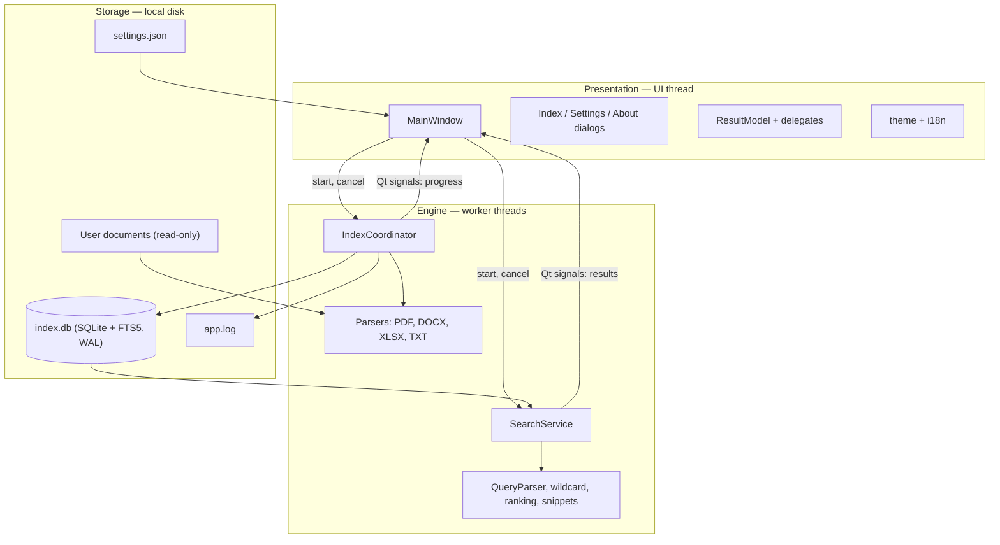
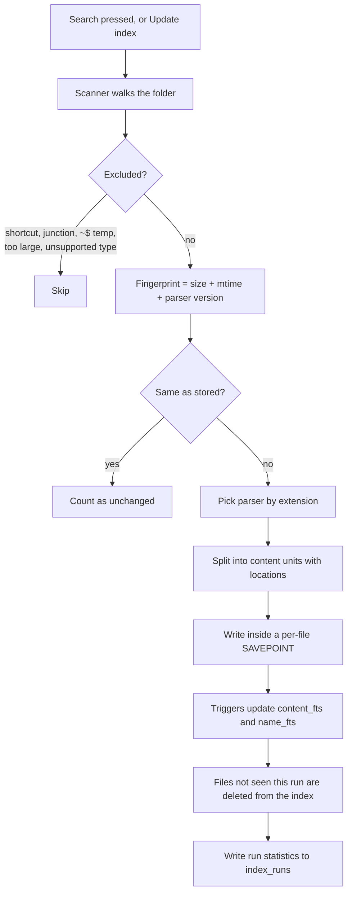
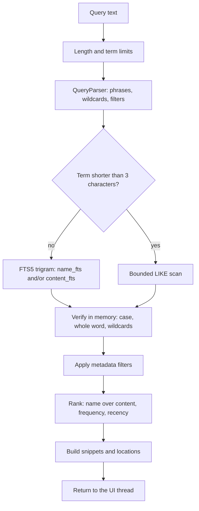
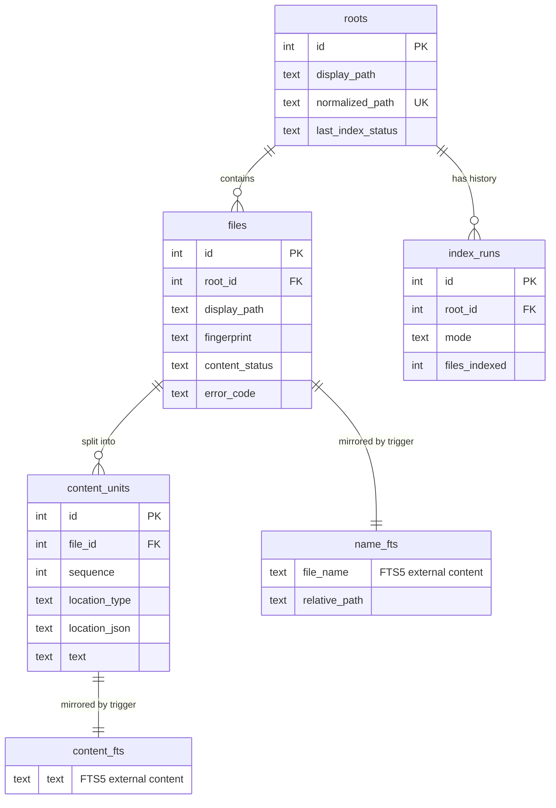

# Architecture

A single-process Windows desktop application. There is no server, no local
web server, no IPC and no network stack — what looks like a "back end" is the
engine layer running on worker threads inside the same process.

The Thai-language edition of this material, with rendered diagrams, is in
`Manual/report.html`.

---

## 1. Layers

The dependency direction is enforced by package boundaries: `ui` may call
`search`, `indexing`, `storage` and `core`; nothing below `ui` imports it.
That is what makes almost the whole system testable without opening a window.

| Package | Responsibility |
|---|---|
| `core` | Constants, value objects, settings, path security, i18n, app paths |
| `indexing` | Walking the tree, fingerprinting, parsing, writing units |
| `search` | Parsing the query, running it, verifying, ranking, snippets |
| `storage` | Connections, schema, migrations, repositories |
| `ui` | Windows, dialogs, models, delegates, worker wrappers |
| `winplat` | Windows-specific path handling, shell integration, single instance |

---

## 2. Indexing

A unit is the smallest addressable piece of a document: a PDF page, a Word
paragraph or table cell, a spreadsheet cell, a line of text. Storing units
rather than whole documents is what allows the application to answer *where*
a match is, and it bounds the memory used by any single file.

Failure is per file. A corrupt or password-protected document is recorded
with an error code and the run continues.

---

## 3. Search

The verification step exists because the index cannot express everything the
query can. A trigram index is case-insensitive and knows nothing about word
boundaries or wildcards, so it is treated as a fast candidate filter and the
real semantics are applied to the candidate text.

When the matching unit is short — one line of a text file, say — the units on
either side are pulled in and the snippet is rebuilt over the combined text,
so the preview reads as context rather than a fragment.

---

## 4. Concurrency

| Thread | Does | Database connection |
|---|---|---|
| UI | Draws, and reads small facts such as index status | Its own |
| Search worker | Runs one search, reports results | Its own, read-only in practice |
| Index worker | Runs one indexing pass, reports progress | Its own, writing |

Rules that keep this safe:

- Connections are never shared between threads.
- WAL journalling lets the search read while the indexer writes.
- Every result carries a job number; the UI discards anything that is not the
  current job, so a slow search cannot overwrite a newer one.
- Cancellation is a flag checked at safe points, never a killed thread.
- A search that hits a transient SQLite error (`database is locked`,
  `vtable constructor failed` while the FTS index is being optimised) drops
  its connection, waits 120 ms and retries once — the failure mode that made
  a search return an empty list while the index refreshed.

---

## 5. Data model

Both FTS tables are **external-content** tables: the text lives once in
`content_units` (or `files`) and the index refers back to it. Six triggers
keep them in step, so correctness does not depend on every write path
remembering to update the index.

`PRAGMA` settings: `journal_mode=WAL`, `synchronous=NORMAL`,
`foreign_keys=ON`, `secure_delete=ON`. The last one matters here: text
removed from the index is overwritten rather than left in free pages.

---

## 6. Integrations

There are three, all local:

| Integration | Mechanism | Note |
|---|---|---|
| Opening a document | `os.startfile`, falling back to the `openas` verb | The shell chooses the program; the application never executes anything itself |
| Revealing a file | `SHOpenFolderAndSelectItems` via `ctypes` | No command line is built, so quoting cannot break it |
| Single instance | Named mutex | Prevents two processes writing one index |

No HTTP client, no telemetry, no update check, no WebView, no fonts or assets
fetched at run time. `scripts/verify_build.py` fails the build if a Qt network
or WebEngine DLL appears in the distribution.

---

## 7. Design decisions

Recorded as ADRs in [`decisions/`](decisions/) and indexed in
[`DECISIONS.md`](DECISIONS.md). The ones that explain the most structure:
trigram tokenization (0001), the database design (0002), cell-level
spreadsheet granularity (0003), fingerprinting instead of hashing (0004), the
wildcard matcher (0005), onedir packaging (0006), and the local-path and
reparse-point rules (0008).
